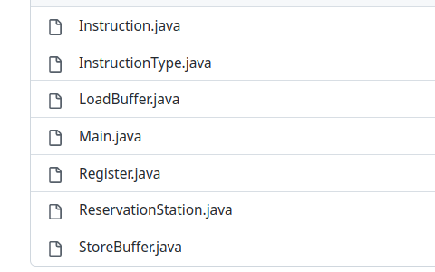

## Tomasulo algorithim 

### 1. Introduction
- Tomasulo's algorithm is a computer architecture hardware algorithm for dynamic scheduling of instructions that allows out-of-order execution and enables more efficient use of multiple execution units. It was developed by John E. Tomasulo in 1967. The algorithm is named after him. The algorithm is used in modern superscalar processors to increase the number of instructions executed per clock cycle. It is a form of dynamic scheduling, which means that the instructions are not scheduled in the order in which they appear in the program. Instead, the instructions are scheduled dynamically, based on the availability of the execution units and the operands. The algorithm is also known as the reservation station algorithm.

### 2. Approach
- We have done 2 projects one Java with CLI  and React with UI using typescript .
- The Java Project Logic is more Tested and we will evaluate with it .
- assumptions :
  - we don't handle the clashes of the same effective address as the description allowed .
  - we can do multiple load and store at the same time and the same effective address as the professor said .
  - when 2 instructions write back at the same time we give the priority to the instruction according to FIFO .
  - Reservation Stages and buffers size are dynamic depending on the input .
  - Latencies are dynamic depending on the user input .
  - Memory dynamic depending on the user input .
  - number of Float Registers are 32 as like Tomasulo .

### 3. Code structure




- The code is divided into 7 main classes:
  - Load Buffer :
  
  	- String name; :  representing station name
  	- boolean busy : if it is busy an instruction execution
  	- InstructionType instructionType=InstructionType.LOAD;
  	- int effectiveAddress; : index in memory
  	- int timeRemaining; : time left for execution to finish
    - int destinationIndex; : register index in the register file
    - double destinationValue; : value that will be written in the register file
    - int arrivalTime; : for fifo 

  - Store Buffer :
  	- String name; :  representing station name
  	- boolean busy : if it is busy an instruction execution
  	- InstructionType instructionType=InstructionType.LOAD;
  	- int effectiveAddress; : index in memory
  	- int timeRemaining; : time left for execution to finish
  	- double V; : operand value
    - String Q; :  waiting for specific station for operand
   
  
  - ReservationStation:
    - String name : representing station name
  	- boolean busy : if it is busy an instruction execution
  	- InstructionType instructionType : instruction type
  	- double Vj; : operand1 value
  	- double Vk; : operand2 value
  	- String Qj; : waiting for specific station for operand1
  	- String Qk; : waiting for specific station for operand1
  	- double A;
  	- int timeRemaining; : time left for execution to finish
    - int destinationIndex; : register index in the register file
    - double destinationValue; : value that will be written in the register file
    - int arrivalTime; : for fifo 
    -   
  - Instruction: which is the class that represents the instruction and it's attributes.
    - InstructionType: which is the Enum that represents the instruction type.
    -  Arithmetic Instruction:
       -  source1: source register1 index
       -  source2: source register2 index
       -  destination: source register2 index
       -  effective address : null


    -  Memory Instruction:
       - Store :
         - source1: source register1 index
         -  source2: null
         -  destination : null
         -  effective address : index in the memory
       - Load :  
            - source1: null
            -  source2: null
            -  destination : index of th register
            -  effective address : index in the memory

  - Register: 
    - name
	- value
	- Q 
  
  - Main: 
    - clockcycle 
    - instructionQueu:Queue[Instruction]
    - issuedStation : to gurantee the instruction that is issued dont execute in the same cycle
    - add reservation station : ReservationStation[]
    - mul reservation station:ReservationStation[]
  	- LoadBuffer[] loadBuffers;
	- StoreBuffer[] storeBuffers; 
	- Register[] regFile;

    - Sequence:
      - 1. fill the instruction queue by the user input from file we parse each instruction independently then add to instruction queue .
      - 2.  fill the latencies by the user input .      

      -  3.  Intialize the reservation stations.
      -  4. Issue an instruction to a reservation station and make sure that it wont execute in the same cycle and start from the next cycle
      - 5. execute functions :
        - ExecuteALUInstruction(addReservationStations);
  		- ExecuteALUInstruction(mulReservationStations);
  		- ExecuteLoadInstruction(loadBuffers);
  		- ExecuteStoreInstruction(storeBuffers);
      - 6. write back function :
        - store always is able to write back .
        - based on FIFO with instruction Queue we write back the first finished instruction .
        -  we update the stations based on the write back .
        -  we empty the station that wrote back and make it un busy .


### 4. Test Cases

#### 1.1. Test Case 1
- Instructions Assembly:

```
L.D F10,100
MUL.D F12,F7,F13
ADD.D F5,F6,F11
DIV.D F6,F5,F2
SUB.D F4,F8,F9
S.D F20,50
```


#### 1.2. Test Case 2

- Instructions Assembly:

```
S.D F6, 90
L.D F6, 120
ADD.D F7, F6, F5
MUL.D F6, F1, F2
DIV.D F7, F7, F2
S.D F7, 150
SUB.D F10,F7,F1
```

- Latencies:
```
latencyADD=3;
latencySUB=3;
latencyMUL=4;
latencyDIV=5;
latencyLOAD=5;
latencySTORE=1;
```


